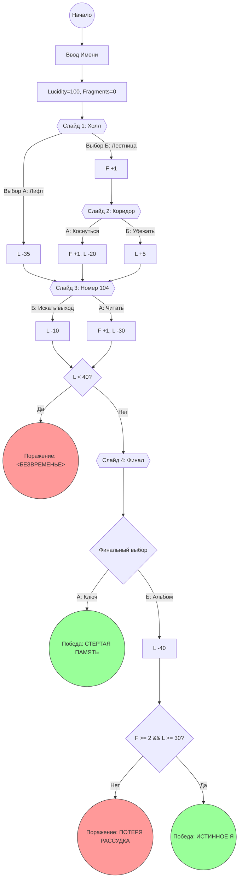

# interactive-web-quest

Web-based text quest built with Java Servlets, JSP and Maven.

## *1. Стек технологий*

```text
1. Java 21
2. Maven 
3. Servlet API 4.0
```

## *2. Функционал*

```text
Приложение веб-квест, которое принимает решения пользователя, хранит состояния игры, показывает результат.
```



## *3. Инструкция по запуску*

```text
Требует Java 21 и Maven 3.9
```

